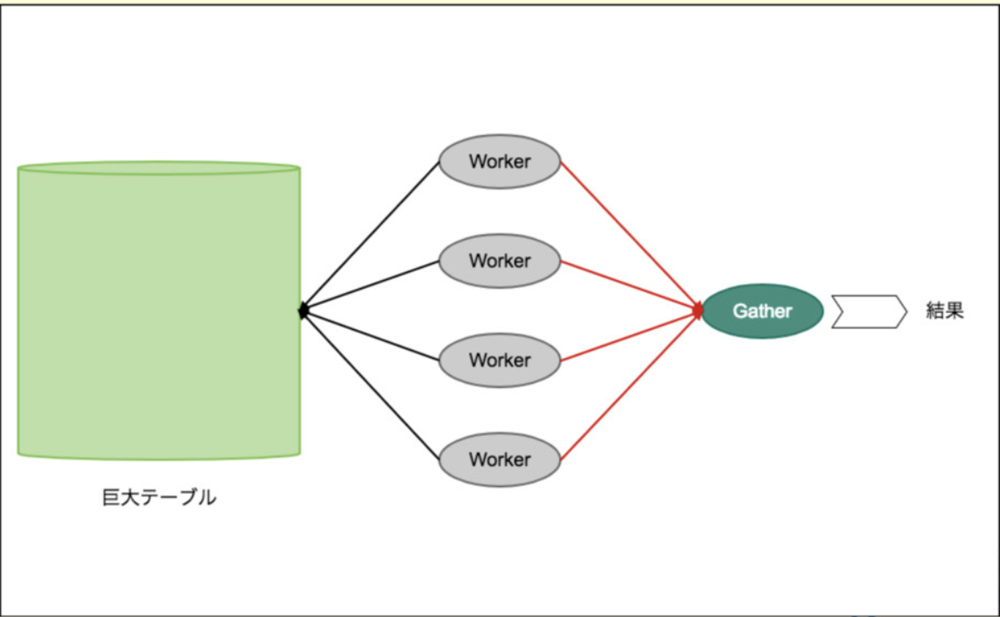
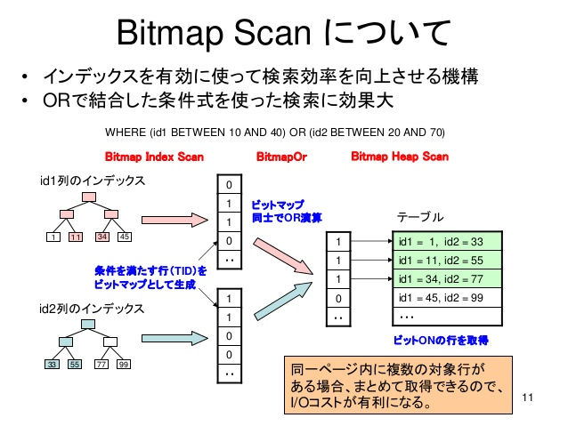

# ３． テーブルにインデックスを貼ってSQLの高速化をしてみよう。

それでは、SQLの高速化を行ってみたいと思います。

- コンテナに入って PostgreSQLにログインしてる状態とします。

```
$ docker-compose exec postgres bash

root@58da2a0c083e:/opt/postgres# psql -U osc_user osc_demo
psql (11.5 (Debian 11.5-1.pgdg90+1))
Type "help" for help.

osc_demo=# 

```

## 今のデータを取ってみる。

まずは 顧客情報を１件取ってみましょう。

```
osc_demo=# SELECT * FROM customers WHERE name = 'percy.wolff';

   id   |       last_login       |                       email                       | password  |    name     | sex |  birthday  |       created_at       |       upda
ted_at       
--------+------------------------+---------------------------------------------------+-----------+-------------+-----+------------+------------------------+-----------
-------------
 271643 | 2017-02-10 11:45:05+00 | 79b8e88d-8f30-322f-aab8-ce5658f38235@schulist.biz | x&KN$Cg8] | percy.wolff |   1 | 1939-12-18 | 2017-02-10 11:45:05+00 | 2017-02-10
 11:45:05+00
(1 row)

```

恐らく一瞬で返ってきたと思います。

では、PostgreSQLでは、どういう風にこのSQLを解釈しているのでしょうか？ それを調べるコマンドがPostgreSQLにあります。 それが **Explain** と呼ばれるものです。  
使い方は簡単で 先程のSQL文の 先頭に `EXPLAIN ANALYZE ` を付けるだけです・

では、実行してみましょう。

```
osc_demo=# EXPLAIN ANALYZE SELECT * FROM customers WHERE name = 'percy.wolff';

                                                        QUERY PLAN                                                         
---------------------------------------------------------------------------------------------------------------------------
 Gather  (cost=1000.00..10172.63 rows=3 width=110) (actual time=170.646..174.786 rows=1 loops=1)
   Workers Planned: 2
   Workers Launched: 2
   ->  Parallel Seq Scan on customers  (cost=0.00..9172.33 rows=1 width=110) (actual time=134.860..136.997 rows=0 loops=3)
         Filter: ((name)::text = 'percy.wolff'::text)
         Rows Removed by Filter: 133333
 Planning Time: 2.530 ms
 Execution Time: 174.869 ms
(8 rows)

```

先程と実行結果が変わったと思います。

では、意味をもう少し噛み砕いて見たいと思います。

## Explain文で内容を見てみる。

見るべきポイントは 数点だけです。

- **Parallel Seq Scan on customers**
- **Execution Time: 174.869 ms**

前者には customers テーブルをどのように見ていったのか という内容が記されています。

今回は `Parallel Seq Scan` という事で パラレルクエリという仕組みを使って Seq Scan をした、という風になっています。

### パラレルクエリ とは

パラレルクエリは以下のようなイメージです。  
一つのSQLを worker という複数のプロセスで集計をして最後に集計結果を統合して値を返すような仕組みの事です。



### Seq Scan とは

`Seq Scan` というのは 一番シンプルで分かりやすい Scanの方法です。

サイトを見ると分かるように すべてのデータを一つずつ順番に照合して 条件に合うかを検索していくScanの手法です。


### 今回のチューニングポイント

Seq Scan は シンプルでわかりやすいですが、当然一個取り出して照合 => 一個取り出して照合 .. と進めていくので データが多ければ多いほど 実行時間が掛かりそうです。

という事で 今回は `Seq Scan` をどうにかして 辞めさせる事を検討します。

Seq Scan が遅くならないようにする手法はいくつかあるのですが、今回は `name = 'percy.wolff'` と 条件が name だけを照合しているのと、登録データとして **同名のユーザーはそれほど多くならないだろう** という点で 「indexを貼って高速化」 というのをやってみたいと思います。

## インデックスを貼ってみる。

それでは、インデックスを貼ってみます。

```
osc_demo=# CREATE INDEX customers_name_idx ON customers (name);
CREATE INDEX

osc_demo=# 
```

`customers` の `(name)` カラムに `customers_name_idx` という名前で `CREATE INDEX` しました、という構文です。

また、今回は Indexを作った瞬間なので 統計情報を更新して起きます。

```
osc_demo=# ANALYZE VERBOSE customers;
INFO:  analyzing "public.customers"
INFO:  "customers": scanned 7089 of 7089 pages, containing 400000 live rows and 0 dead rows; 30000 rows in sample, 400000 estimated total rows
ANALYZE

osc_demo=#

```

これで index がはられた状態になりました。

さて、では高速化がどれだけ効いたでしょうか。 試してみたいと思います。

```
osc_demo=# EXPLAIN ANALYZE SELECT * FROM customers WHERE name = 'percy.wolff';
                                                        QUERY PLAN                                                         
---------------------------------------------------------------------------------------------------------------------------
 Bitmap Heap Scan on customers  (cost=4.45..16.30 rows=3 width=110) (actual time=2.301..2.319 rows=1 loops=1)
   Recheck Cond: ((name)::text = 'percy.wolff'::text)
   Heap Blocks: exact=1
   ->  Bitmap Index Scan on customers_name_idx  (cost=0.00..4.45 rows=3 width=0) (actual time=2.275..2.284 rows=1 loops=1)
         Index Cond: ((name)::text = 'percy.wolff'::text)
 Planning Time: 6.774 ms
 Execution Time: 2.918 ms
(7 rows)

```

先程 Explain したときとも結果が異なりました。 では、違いをみてみましょう。

| 項目 | Index構築前 | Index構築後 |
| --- | --- | --- |
| スキャン方法 | Parallel Seq Scan | Bitmap Headp Scan |
| 実行時間 | 174.869 ms | 2.918 ms |

Scan方法がまず変わりました。 Bitmap Scan となってます。



(cf. https://www.slideshare.net/naka24nori/explain20 より引用)

インデックスをより有効に使って、検索効率が向上されています。

また、 Scan実行時間が　175mms から　3ms などと 役60倍化の高速に成功しました！

## 終わりに

さて、今回は Indexを使ってDBを高速化する処理をやってみました。

こことかは割と基本的な所ではありますが、ぜひとも基本を押さえて よりよいエンジニアライフをお過ごしください！！


---

[Topへ戻る](https://github.com/TakahashiIkki/osc2019-shimane/blob/master/HANDS_ON.md)